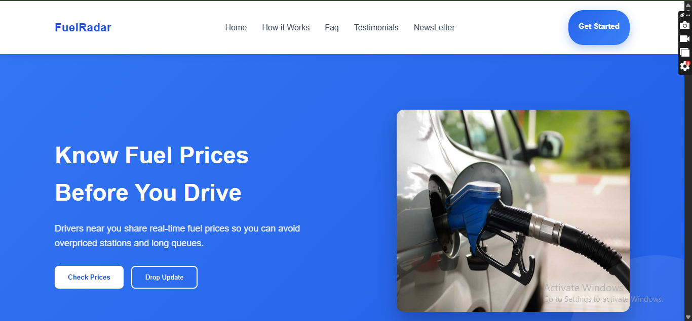

🚀 FuelRadar

Find the cheapest fuel near you, instantly ⛽

🔥 Features

✅ Real-time Fuel Price Tracker – Compare fuel prices near you.

✅ Coming Soon Page – Collect emails for early access.

✅ Live Join Counter – Track how many users signed up.

✅ Email Validation & Duplicate Check – Only valid submissions allowed.

✅ Confetti Animation – Fun visual feedback for new signups.

✅ Responsive Design – Looks great on mobile and desktop.

✅ Countdown Timer – Countdown to official launch.

🖥 Tech Stack
Frontend	Backend	Deployment
HTML, CSS, JavaScript	Google Apps Script (Google Sheets)	Vercel / Netlify / GitHub Pages

📸 Demo

Confetti animation celebrates each new signup.

🎯 Live Counter & Signup Flow

User enters email.

Email is validated & checked against duplicates.

Success triggers confetti animation & updates live counter.

Users are notified they’re on the waitlist.

🏗 Folder Structure
FuelRadar/
│
├─ index.html          # Coming Soon page
├─ README.md           # Project documentation
├─ favicon.png         # Site icon
├─ assets/             # Images, banners, GIFs
└─ scripts/            # Optional JS files
⚡ Usage

Clone the repo:

git clone https://github.com/para-Codz/FuelRadar.git

Open index.html in your browser to view the coming soon page.

Set your Google Apps Script URL in the API_URL variable for email collection.

🚀 Future Plans

Integrate Google Maps API for real-time nearby stations.

Add user login and personal preferences.

Send dynamic price alerts via email.

Turn FuelRadar into a PWA for offline use.

📝 License

MIT License © 2026 Paradise Samuel George
